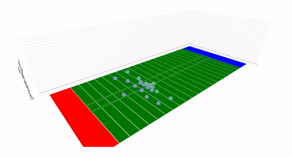
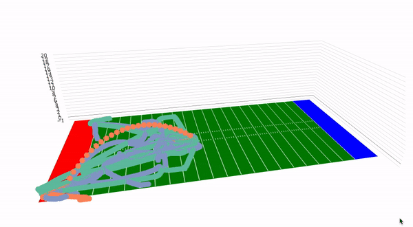

parabolizR
================

The goal of this project is to interpolate the z-values for the ball
from the NGS-Highlight tracking data that is available. The following is
an example of the usage:

First we get the NGS highlight data using the NGS highlights library
(<https://github.com/asonty/ngs_highlights>)

``` r
source_url("https://raw.githubusercontent.com/asonty/ngs_highlights/master/utils/scripts/data_utils.R")
source_url("https://raw.githubusercontent.com/asonty/ngs_highlights/master/utils/scripts/plot_utils.R")
play_data <- fetch_play_data(playKey_ = 248)
```

Then we can call the `add_z()` function to add the `z` axis to a given
play.

``` r
added_z <- add_z_to_play(play_data)
```

Then we can plot the given play in two forms`three_d_animate()` or
`three_d_animate_static()`. `three_d_animate()` gives us an animated
frame by frame visualization of the results, and
`three_d_animate_static()` gives us a static image with all of the paths
rendered at once.

``` r
fig <- three_d_animate(added_z)
```

``` r
fig <- three_d_animate_static(added_z)
```

The charts are made in `plotly` and thus we cannot embed the live
version of the chart, but here are the gifs showing the two charts:

<center>

 

</center>

## The Physics Behind the Calculation

The following document contains the work for the physics calculations
behind the
functions.

<object data="https://github.com/dutta/parabolizR/blob/master/Physics_of_Ball.pdf" type="application/pdf" width="700px" height="700px">

<embed src="https://github.com/dutta/parabolizR/blob/master/Physics_of_Ball.pdf">

<p>

This browser does not support PDFs. Please download the PDF to view it:
<a href="/Physics_of_Ball.pdf">Download PDF</a>.

</p>

</embed>

</object>
